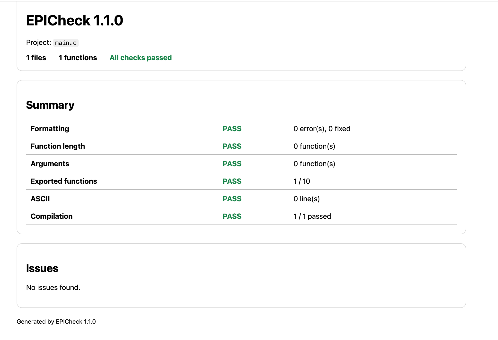

# EPICheck

[](https://github.com/cyril-huet/epicheck/actions/workflows/ci.yml)


[](LICENSE)

EPICheck is a small command-line tool written in C that checks C and C++
projects.

It can verify source formatting, detect non-ASCII characters, compile source
files and check a few simple code limits. Reports can be displayed in the
terminal or generated as JSON, HTML and GitHub Actions output.

## Overview

This project was built to learn how a command-line development tool works.
It explores directory traversal, source-code analysis, process execution and
report generation using standard C and POSIX functions.

The implementation intentionally uses straightforward code: explicit
`if`/`else` blocks, braces around every control statement and simple loops.

The project covers concepts such as:

- command-line argument parsing
- recursive directory scanning
- basic C and C++ source analysis
- execution of external programs
- dynamic arrays
- text, JSON, HTML and GitHub reports
- shell-based integration tests

## How it works


## Features

- Recursive scanning of C and C++ projects
- `clang-format` verification and automatic formatting
- Detection of non-ASCII characters
- Syntax-only compilation of C and C++ files
- Maximum number of lines per function
- Maximum number of arguments per function
- Maximum number of exported functions
- Custom C and C++ compilation flags
- Path exclusions
- Text, JSON, HTML and GitHub Actions output
- Optional Git pre-push hook
- Linux and macOS support

## Default limits

EPICheck uses the following limits by default:

| Check | Limit |
|---|---:|
| Lines per function | 40 |
| Arguments per function | 4 |
| Exported functions | 10 |

The limits can be changed from the command line.

## Build

Build the project using `make`:

```sh
make
```

The resulting binary will be located at:

```text
./epicheck
```

## Usage

```text
./epicheck [path] [options]
```

Check the current directory:

```sh
./epicheck
```

Check another project:

```sh
./epicheck ../my-project
```

Run every check in strict mode:

```sh
./epicheck . --strict
```

The `--push` option is an alias for `--strict`:

```sh
./epicheck . --push
```

Automatically fix formatting errors:

```sh
./epicheck . --fix
```

Exclude a matching path:

```sh
./epicheck . --exclude build --exclude vendor
```

Use different code limits:

```sh
./epicheck . --max-lines 50 --max-args 6 --max-exported 20
```

### Example

```console
$ ./epicheck my-project

EPICheck 1.1.0
Project: my-project
Files: 8, functions: 42

Summary
  format       OK    0 error(s), 0 fixed
  length       OK    0 function(s)
  arguments    OK    0 function(s)
  exports      OK    8 / 10 per file
  ascii        OK    0 line(s)
  compile      OK    7 / 7 passed

Result: all checks passed
```

## Output formats

### Text

Text output is used by default:

```sh
./epicheck . --output text
```

### JSON

JSON output can be saved and used by other tools:

```sh
./epicheck . --output json > epicheck-report.json
```

### HTML

HTML output automatically creates `epicheck-report.html` in the current
directory:

```sh
./epicheck . --output html
```

Open the report on macOS:

```sh
open epicheck-report.html
```

Open the report on Linux:

```sh
xdg-open epicheck-report.html
```

The report contains its own CSS and works without an internet connection.
An existing `epicheck-report.html` file is replaced.



### GitHub Actions

GitHub output creates annotations that are visible directly in a workflow:

```sh
./epicheck . --output github
```

## Options

### Checks

| Option | Description |
|---|---|
| `--format`, `--no-format` | Enable or disable formatting checks |
| `--ascii`, `--no-ascii` | Enable or disable ASCII checks |
| `--compile`, `--no-compile` | Enable or disable compilation checks |
| `--strict`, `--push` | Enable every check and require external tools |
| `--fix` | Fix formatting errors with `clang-format` |

### Configuration

| Option | Description |
|---|---|
| `--exclude PATTERN` | Exclude matching paths |
| `--cflags FLAGS` | Add flags when checking C files |
| `--cxxflags FLAGS` | Add flags when checking C++ files |
| `--max-lines N` | Set the maximum lines per function |
| `--max-args N` | Set the maximum arguments per function |
| `--max-exported N` | Set the maximum exported functions per file |

### Output and other options

| Option | Description |
|---|---|
| `--output FORMAT` | Use `text`, `json`, `html` or `github` |
| `--no-color` | Disable terminal colors |
| `--install-hook` | Install a Git pre-push hook |
| `--version` | Display the installed version |
| `--help`, `-h` | Display the help message |

## Git pre-push hook

Install a pre-push hook in the current Git repository:

```sh
./epicheck --install-hook
```

The hook runs EPICheck before each `git push`. The push is stopped when a check
fails.

## Installation

Install EPICheck in `/usr/local/bin`:

```sh
sudo make install
```

It can also be installed without administrator permissions:

```sh
make install PREFIX="$HOME/.local"
```

In that case, `$HOME/.local/bin` must be present in the `PATH` environment
variable.

Uninstall EPICheck with:

```sh
sudo make uninstall
```

## Tests

The project includes an integration test suite.

Run the tests with:

```sh
make test
```

Check the source formatting with:

```sh
make check-format
```

Build with AddressSanitizer and UndefinedBehaviorSanitizer:

```sh
make sanitize
make test
```

## Project structure

```text
epicheck/
├── include/
│   └── epicheck.h
├── src/
│   ├── analyzer.c
│   ├── hook.c
│   ├── main.c
│   ├── options.c
│   ├── report.c
│   ├── scanner.c
│   └── util.c
├── tests/
│   └── test.sh
├── Makefile
└── README.md
```

## Exit codes

| Code | Meaning |
|---:|---|
| `0` | Every enabled check passed |
| `1` | One or more project checks failed |
| `2` | Invalid command, hook error or report creation error |

## License

This project is distributed under the MIT License.
